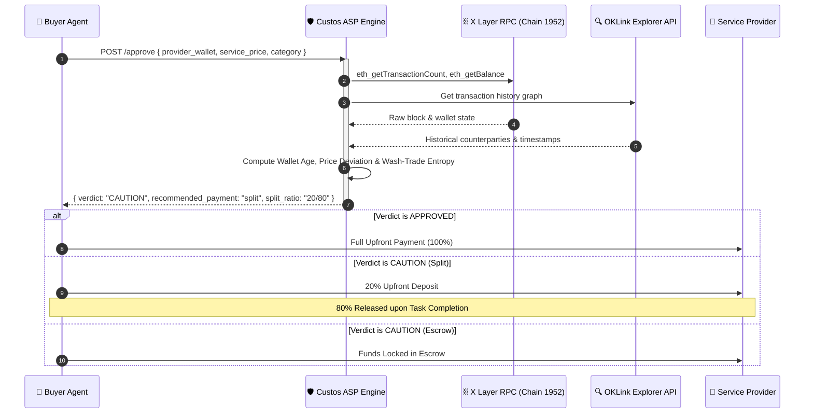

<div align="center">

# 🛡️ Custos
### Pre-Transaction Decision Engine for OKX.AI

**The Financial Risk Layer for Autonomous Agent-to-Agent Payments on X Layer**

[](https://www.okx.com/)
[](https://testrpc.xlayer.tech)
[](https://modelcontextprotocol.io)

</div>

---

## 🎯 The Core Problem

In the **OKX.AI agentic economy**, thousands of AI agents autonomously hire and pay other Agentic Service Providers (ASPs) via micropayments. 

> [!IMPORTANT]
> **CertiK asks:** *"Is this smart contract or token safe?"*  
> **Custos asks:** *"Is this specific transaction, today, with this provider, at this price, safe?"*

Without human intuition, autonomous agents are vulnerable to **wash-trading bots**, **price gouging**, and **sybil provider networks**. Static reputation scores fail because reputational history can be easily spoofed or farmed.

Custos acts as an **Agentic Service Provider (ASP)** that intercepts pre-payment decisions. It evaluates real, verifiable on-chain data on **X Layer** and returns an **actionable payment structure recommendation** (`full_upfront`, `split 20/80`, or `escrow`) — never a static or fabricated reputation score.

---

## 📐 Architecture & Agentic Flow



---

## 🔍 Verifiable On-Chain Signals

Custos relies **100% on verifiable X Layer chain state** and OKLink indexer data:

| Signal | Source | Algorithm / Logic | Actionable Impact |
| :--- | :--- | :--- | :--- |
| **Wallet Age** | X Layer RPC & OKLink | Timestamp of first verified transaction on X Layer. | Flags wallets `< 7 days` old as elevated counterpart risk. |
| **Transaction Depth** | X Layer RPC (`eth_getTransactionCount`) | Total confirmed transaction count. | Triggers **Thin-History Fallback** for `< 5 txs` without fabricating metrics. |
| **Price Deviation** | Computed vs History / Category | Ratio of requested price relative to provider's historical average or category median. | `≥ 2.0x` triggers **Split (20/80)**; `≥ 3.0x` mandates **Escrow**. |
| **Wash-Trade Sybil Entropy** | Counterparty Graph Analysis | Calculates address distribution ratio & interval variance across incoming txs. | `> 60%` volume from ≤ 3 wallets or uniform time intervals mandates **Escrow**. |

---

## 🧪 Demo Test Scenarios

Test all pre-configured scenarios live in the interactive **[Custos Dashboard Console](http://localhost:5173/console)**:

| Scenario | Input Wallet | Price (OKB) | Computed Verdict | Recommended Structure | Reason Summary |
| :--- | :--- | :---: | :---: | :---: | :--- |
| **Established** | `0x742d35Cc...f44e` | `40.0` | `APPROVED` | `full_upfront` | 120d age, 48 txs, normal price alignment. |
| **Price Spike** | `0x742d35Cc...f44e` | `150.0` | `CAUTION` | `split` (20/80) | Price is **3.75x** above historical average (40 OKB). |
| **Wash Trade** | `0x99999999...9999` | `25.0` | `CAUTION` | `escrow` | **60%+** of incoming volume originates from 2 wallets. |
| **Thin History** | `0x00000000...0001` | `30.0` | `CAUTION` | `split` (20/80) | Unfunded/new wallet fallback applied cleanly. |

---

## 💻 1-Line Developer SDK

Any hackathon developer can make their AI agent safe with **one line of code**:

```typescript
import { custos } from 'custos-okx-asp';

// Single-line guard — evaluates risk & routes payment automatically
const { decision, paymentResult } = await custos.guard(
  {
    provider_wallet: "0x742d35Cc6634C0532925a3b844Bc454e4438f44e",
    buyer_wallet:    "0x1234567890abcdef1234567890abcdef12345678",
    service_price:   40.0,
    service_category:"code_generation"
  },
  async (verdict) => {
    // Automatically routes via recommended structure (Escrow / Split / Full)
    return await executePayment(verdict.recommended_payment);
  }
);
```

---

## 🔌 Model Context Protocol (MCP) Setup

Custos ships with a native **Stdio MCP Server** (`src/mcp/server.ts`) for Cursor, Claude Desktop, and OKX AI agent runners.

Add to your `claude_desktop_config.json` or `.cursor/mcp.json`:

```json
{
  "mcpServers": {
    "custos": {
      "command": "node",
      "args": ["/path/to/Custos/dist/mcp/server.js"],
      "env": {
        "XLAYER_RPC_URL": "https://testrpc.xlayer.tech",
        "XLAYER_CHAIN_ID": "1952"
      }
    }
  }
}
```

---

## 💳 x402 Micropayment Protocol

Custos supports the **OKX.AI x402 Specification** for pay-per-call service monetization. Unauthenticated API calls return an `HTTP 402 Payment Required` response:

```http
HTTP/1.1 402 Payment Required
WWW-Authenticate: x402 realm="Custos ASP"
Content-Type: application/json

{
  "status": 402,
  "message": "Payment Required: Custos ASP endpoint requires x402 header.",
  "x402": {
    "protocol": "x402",
    "version": "1.0",
    "recipient": "0x71C7656EC7ab88b098defB751B7401B5f6d8976F",
    "amount_usdt": "0.01",
    "chain_id": 1952
  }
}
```

---

## 🚀 Local Setup & Installation

### Prerequisites
- **Node.js**: `v20.x` or higher
- **npm**: `v10.x` or higher

```bash
# 1. Clone Repository
git clone https://github.com/GreatSage-dev/Custos.git
cd Custos

# 2. Install Dependencies
npm install

# 3. Launch Development Server (Express API :3000 + Vite Frontend :5173)
npm run dev
```

Visit **[http://localhost:5173](http://localhost:5173)** to open the web console!

---

## 🏆 Hackathon Metadata

- **Event:** OKX.AI Genesis Hackathon
- **Track:** Finance Copilot
- **Target Network:** X Layer Testnet (Chain ID 1952)
- **Explorer:** OKLink X Layer Testnet Explorer
- **License:** MIT

---

<div align="center">
  <sub>Built with ❤️ for the OKX.AI Genesis Hackathon</sub>
</div>
